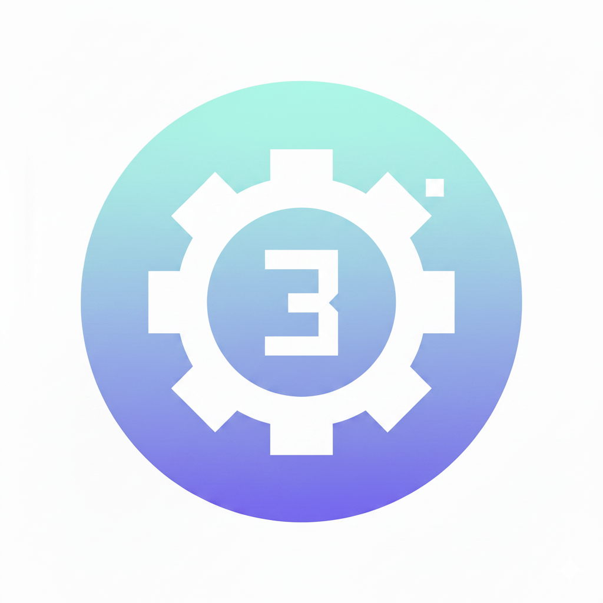

<div align="center">

# 4interview



> *"You have 3 days. Don’t waste them digging through forums.”"*

[](LICENSE)
[](SKILL.md)
[](SKILL.md)

<br>

**One Claude Code command gives you a complete 3-day interview prep file — real candidate experiences, targeted Q&As, and a time-boxed study plan, all specific to your company and role.**

Stop searching Blind, Glassdoor, and Reddit. One command does it all.

<br>

</div>

---

## The problem

You have an interview at Google, Stripe, or Capital One in a few days. You:

Open Blind — posts are 3 years old. Open Reddit — thread is locked. Open Glassdoor — paywall. Two hours gone, nothing prepared.

And not all interviews are the same. Sometimes it's not just Leetcode or System Design — it's a domain-specific technical screen, a take-home, a case study, or something the recruiter barely explained. So you're not just searching, you're searching for the right thing, and that can cost you hours you don't have.

## What this does instead

Type `/4interview` in Claude Code. It asks you 5 questions (company, role, interview type, job description, HR notes). Then it:

1. Searches Reddit, Blind, Glassdoor, Leetcode discussions, and GitHub repos for real candidate reports — calibrated to your exact company, role, and interview type
2. Extracts the topics that actually came up, not generic advice
3. Writes a single markdown file with everything: focus areas with study links, 3–4 real past candidate experiences with source URLs, a time-boxed 3-day plan, and 10–30 questions with full answers

**Output:** one `.md` file you open in VSCode or Obsidian and work through. No chat scrolling.

---

## Install

```bash
mkdir -p ~/.claude/skills/4interview
curl -fsSL https://raw.githubusercontent.com/a3agalyan/4interview/main/SKILL.md \
  -o ~/.claude/skills/4interview/SKILL.md
```

Requires [Claude Code](https://claude.ai/code).

---

## Usage

In any Claude Code session:

```
/4interview
```

The skill walks you through inputs one at a time, confirms before running, then writes the file.

### Inputs

| Field | Required | What to put |
|---|---|---|
| `company` | Yes | Company name |
| `role` | Yes | Job title and level (e.g. "Senior SWE L5") |
| `interview` | Yes | Interview type: System Design, Behavioral, Coding, ML Design, Technical Screen |
| `job-description` | Optional | Paste the job posting — Claude extracts the tech stack and requirements |
| `hr-notes` | Optional | Anything the recruiter said — topics mentioned, format, scheduling emails |
| `additional-notes` | Optional | Your weak spots, anxieties, things you've heard |

### Output file

```
prep-{company}-{role}-{interview}-{date}.md
```

Sections:
- **What This Interview Is About** — specific to this company, not generic
- **Focus Areas** — extracted from your notes, each with a study resource and time estimate
- **Past Candidate Experiences** — 3–4 real accounts with source URLs, ranked by specificity
- **3-Day Prep Plan** — time-boxed checklist, specific tasks
- **Questions & Answers** — 10–30, calibrated to your interview type

## License

MIT
